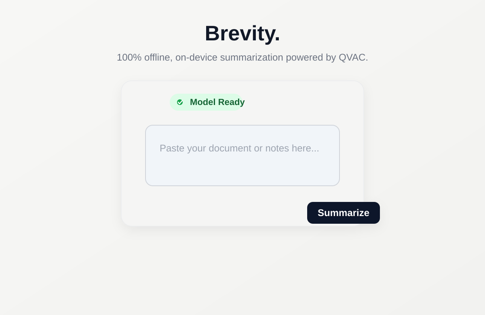

# Brevity

Brevity is a lightweight local AI text summarizer built with Node.js, Express, and the QVAC SDK. It runs a Qwen model locally on the user's machine, so the app can summarize copied text without depending on a remote API or cloud service.

The project is intentionally minimal: a static HTML UI, a small Express server, and a local model-backed inference call. The app is meant to be easy to install, easy to run, and easy to understand.

## Screenshot



## Features

- Local-only summarization flow using the QVAC SDK
- Runs a model on the machine instead of sending text to a cloud API
- Minimal web interface with a text area and summary button
- Automatic fallback when the preferred local port is already in use
- Model loading and status endpoints for startup health checks
- Simple architecture that is easy to extend

## What the app does

The app accepts user text in a browser form, sends it to the backend, and calls a local QVAC model with a summarization instruction. The model processes the text and returns a summary, which is displayed back in the browser.

The purpose is to provide a fast, private, and self-contained summarization tool for local use.

## How it works

### 1. Frontend
The frontend is a single HTML page in `public/index.html`.

It does the following:
- checks the backend status via `/api/status`
- enables the form when the model is ready
- sends the user's text to `/api/summarize` using a POST request
- renders the returned summary in the output panel

### 2. Backend
The backend is in `server.js`.

It does the following:
- creates an Express app
- serves static files from the `public` directory
- initializes the local model with `loadModel(...)`
- exposes `/api/status` to report whether the model is ready
- exposes `/api/summarize` to take incoming text and return a summary

### 3. Model layer
The app uses the QVAC SDK, which loads a local model into memory and exposes completion APIs.

The relevant pattern is:

```js
const modelId = await loadModel({
  modelSrc: MODEL_URL,
  modelType: 'llamacpp-completion'
});

const run = completion({
  modelId,
  history: [{ role: 'user', content: text }],
  stream: true
});
```

This approach is useful because it allows generation to be streamed and then assembled into a final text result.

### 4. Request flow
The flow is:

1. User enters text in the browser.
2. Browser sends it to the Express backend.
3. Server checks whether the model is loaded.
4. Server builds a summarization instruction prompt.
5. QVAC completion is invoked with the model ID and conversation history.
6. Tokens are streamed and concatenated into a final result.
7. Server responds with a JSON object such as:

```json
{ "summary": "A concise summary of the text..." }
```

8. Browser displays that result in the UI.

## Project structure

```text
brevity-qvac/
├── public/
│   └── index.html
├── docs/
│   └── screenshots/
│       └── brevity-ui.svg
├── node_modules/
├── .gitignore
├── package.json
├── package-lock.json
├── README.md
├── server.js
└── ...
```

### Key files

- `server.js` – Express app and local model initialization logic
- `public/index.html` – user interface
- `package.json` – Node dependencies and scripts
- `docs/screenshots/brevity-ui.svg` – documentation screenshot placeholder/example

## Requirements

Before installing, make sure the machine has:

- Node.js 18 or newer
- npm (comes with Node.js)
- Internet access for the first model download
- Enough RAM and CPU for running a local language model
- A supported operating system (Windows, macOS, or Linux)

Recommended:
- 8 GB+ of RAM for smoother model inference
- modern CPU or Apple Silicon / NVIDIA GPU if available

## Installation

### 1. Clone the repository

```bash
git clone https://github.com/tanvir-lnx/brevity-qvac.git
cd brevity-qvac
```

### 2. Install dependencies

```bash
npm install
```

This installs:
- Express
- QVAC SDK

### 3. Start the app

```bash
npm start
```

On first run, the app will begin loading the Qwen model into local memory. That may take some time depending on your machine and internet speed.

### 4. Open the app in a browser

The app will usually launch on:

```text
http://localhost:3001
```

If port 3001 is already occupied, the server automatically tries the next port, for example:

```text
http://localhost:3002
```

### 5. Use the app

- Paste text or notes into the input box.
- Click the Summarize button.
- Wait for the local model to generate the summary.
- Read the result returned in the page.

## Notes about model loading

The first time the app runs, it downloads a model from Hugging Face. This process may take several minutes depending on:

- internet speed
- machine hardware
- available system memory
- whether the model has already been cached

The app logs progress to the terminal while loading the model.

## How to troubleshoot common issues

### Port already in use
If the app says the port is busy, it will automatically retry on another port. You can also force a specific port with:

```bash
PORT=3005 npm start
```

### Model still initializing
The app returns a 503 status while the model is still loading. Wait a few moments and retry.

### Slow summary generation
This is normal for local inference. A larger or more complex document may take longer to process.

### Download fails
Check:
- your internet connection
- whether the remote model URL is still valid
- whether your environment can access Hugging Face

### Dependency problems
Run:

```bash
npm install
```

If needed, remove and reinstall dependencies:

```bash
rm -rf node_modules package-lock.json
npm install
```

## Environment behavior

This app is designed to be local-first:
- the model is loaded on-device
- prompt and text remain local to the machine
- no external summarization service is required after the model is downloaded

This makes it suitable for demonstrations, internal tools, offline prototyping, and privacy-sensitive summarization work.

## Local development notes

If you want to change behavior, the most likely files to edit are:

- `server.js` for backend logic and model lifecycle
- `public/index.html` for UI behavior and layout
- `package.json` for dependencies and scripts

## Example use

Paste text like this:

> The company announced a major expansion to its customer support infrastructure after a 30% rise in ticket volume during the previous quarter. The plan includes a three-phase rollout, new automation, customer support training, and a self-serve help center.

The app will produce a much shorter summary, preserving the main idea and key operational details.

## Security and privacy note

Because the app processes text locally using a downloaded model, it is far more privacy-friendly than sending content to third-party AI APIs. However, the model itself still needs to be downloaded from its source the first time you run it, so internet access is required during setup.

## Future enhancements

Potential improvements for the project include:
- better prompt tuning for more complete summaries
- markdown output support
- multiple summary styles (brief, balanced, detailed)
- copy-to-clipboard button
- export to text or markdown file
- mobile-friendly layout improvements
- dark mode support

## License

This project is licensed under the [MIT License](./LICENSE). You are free to use, modify, distribute, and sublicense the software, subject to the conditions in the license.

## Summary

Brevity is a minimal local summarization app built around the QVAC SDK. It gives a developer or user a simple way to run a local model, paste text, and get a summary without depending on a remote AI backend. The app is intentionally small, readable, and easy to run on a personal machine.

If you want to run it on another machine, the steps are simple: install Node.js, clone the repo, run `npm install`, then `npm start`, and open your browser to the local URL.
